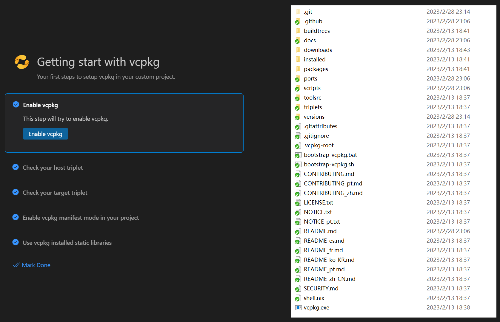

# vcpkg CMake Tools

[Vcpkg VSCode CMake extension](https://marketplace.visualstudio.com/items?itemName=JackBoosY.vcpkg-cmake-tools) provides vcpkg integration in VSCode.

Please report any bugs in [github](https://github.com/JackBoosY/vcpkg-vscode-extension).

## Requirements

- VSCode >= 1.76.0
- CMake Tools extension >= 1.13.0

## Usage

You can use Vcpkg getting start page to control vcpkg behavior.

for more options, please see `Preferences` - `Settings` - `Extensions` - `vcpkg`.

Also, you can manually control vcpkg behavior with the following commands:

### Enable vcpkg integration

1. Ctrl(⌘) + Shift + P
2. Search vcpkg.
3. Select `vcpkg: Enable vcpkg`:

  a. Extension will automaticly enable vcpkg if you already set environment variable `VCPKG_ROOT` or already set vcpkg path in settings.

  b. Extension will automaticly enable vcpkg if vcpkg root folder was selected before.

  c. Otherwise, please choose vcpkg root folder.

4. Extension will select the triplet (dynamic) according to your system architecture, vcpkg toolchain will be added into cmake settings.

You can also enable/disable vcpkg in `Preferences` - `Settings` - `Extensions`(in `workspace`) - `Vcpkg`.

Note: please only enable/disable in `workspace`!

### Disable vcpkg integration

1. Ctrl(⌘) + Shift + P
2. Search vcpkg.
3. Select `vcpkg: Disable vcpkg`.
4. vcpkg toolchain will be removed from cmake toolchain and other vcpkg setting will also be removed from cmake options.

### Use static library

1. Ctrl(⌘) + Shift + P
2. Search vcpkg.
3. Select `vcpkg: Use static library`.

### Use dynamic library

1. Ctrl(⌘) + Shift + P
2. Search vcpkg.
3. Select `vcpkg: Use dynamic library`.

### Set vcpkg additional install options

1. Open `Preferences` - `Settings` - `Extensions`(in `workspace`) - `Vcpkg`.
2. Add additional options one by one in `Vcpkg › Target: Additional Options`.

### Enable/Disable install dependency binaries

1. Open `Preferences` - `Settings` - `Extensions`(in `workspace`) - `Vcpkg`.
2. Select/Unselect `Vcpkg › Target: Install Dependencies`.

### Find system/vcpkg installed libraries first

1. Open `Preferences` - `Settings` - `Extensions`(in `workspace`) - `Vcpkg`.
2. Select/Unselect `Vcpkg › Target: Prefer System Libs`.
